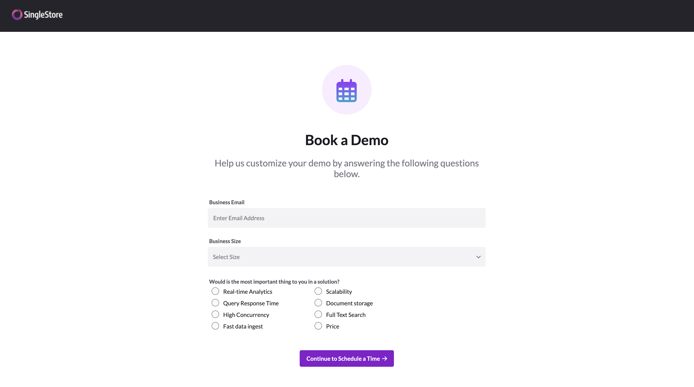

# Book-A-Demo-Website-SingleStore

## Deployed on GH-Pages

## Description
* A Demo Booking webpage with option for features and group size.
* Confirmation pages with the outcomes. (Booked/ Not Booked)
* Built a standalone prototype web page in HTML/CSS/JavaScript
* Design along with the component interactions and logical flow is translated from Figma 
* The page renders a form that includes 3 fields: email, business size, and importance indicator.

## Screenshot
</img>
